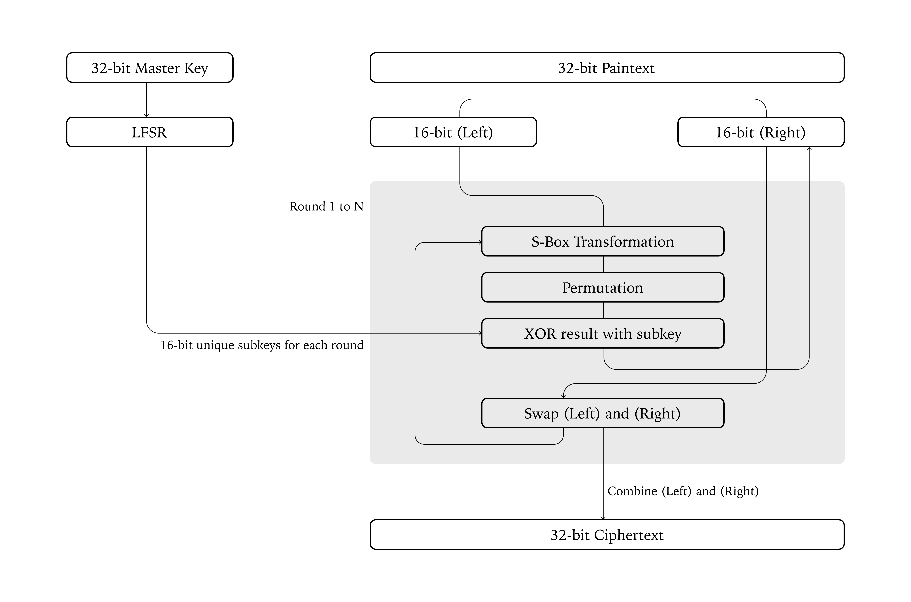

# Feistel-Based Cryptographic Algorithm Report

**Authors:** Phanidhar Akula

---

## 1. Introduction

This cryptographic algorithm uses a Feistel network to provide reversible encryption and decryption. It operates on 32‑bit blocks that are split into two 16‑bit halves. A 32‑bit master key seeds an LFSR (Linear Feedback Shift Register) to generate unique 16‑bit subkeys for each round. In each round, the algorithm applies a key‑dependent 4×4 S‑box (substitution layer) and a fixed P‑box (permutation layer) to provide nonlinearity and diffusion, respectively.

---

## 2. Algorithm Overview

### Feistel Structure

- **Encryption Process:**

  1. **Block Splitting:** The 32‑bit plaintext is split into two 16‑bit halves, L (left) and R (right).
  2. **Subkey Generation:** A 32‑bit master key seeds an LFSR, which generates a unique 16‑bit subkey for each round.
  3. **Round Operations:** For each round, the right half is processed through the S‑box and P‑box, then XORed with the subkey. The halves are then swapped.
  4. **Recombination:** After all rounds, the two halves are combined into a 32‑bit ciphertext.

- **Decryption Process:**
  1. **Block Splitting:** The 32‑bit ciphertext is divided into L and R.
  2. **Subkey Regeneration:** The same LFSR is used with the 32‑bit master key to regenerate subkeys in the same order.
  3. **Inverse Rounds:** The rounds are then processed in reverse order using the same subkeys (applied in reverse) along with the inverses of the S‑box and P‑box.
  4. **Recombination:** The original plaintext is recovered by recombining the halves.

---

## 3. Key Scheduling (LFSR-Based)

### 3.1. How It Works

- **Initialization:**  
  The algorithm starts with a 32‑bit master key that seeds a Linear Feedback Shift Register (LFSR).

- **Subkey Generation:**  
  For each round, the LFSR is shifted one bit to the right. Specific bits (at positions 0, 1, 21, and 31) are XORed to produce a new bit, which is then inserted at the MSB. The lower 16 bits of the new LFSR state become the subkey for that round.

### 3.2. Security Contribution

- **Uniqueness:**  
  Each round uses a different 16‑bit subkey derived from the master key, which prevents attackers from easily predicting key material.
- **Randomness:**  
  The pseudo‑random nature of the LFSR introduces randomness in the subkeys, which thwarts differential and linear attacks.

---

## 4. S-Boxes (Substitution Layer)

### 4.1. How It Works

- **Basic Operation:**  
  The S‑box in this implementation is a 4×4 table. It processes 4‑bit nibbles (values 0–15). For each 16‑bit half, the data is split into four 4‑bit nibbles; each nibble is substituted by looking up its value in the S‑box.

- **Key Dependency and Seed the Random Generator:**  
  The S‑box is generated randomly based on the 32‑bit master key. The master key is used to seed a pseudo-random number generator. This ensures that the same master key always produces the same sequence of "random" numbers. This random permutation is used as the S‑box mapping, and its inverse is computed for decryption.

### 4.2. Security Contribution

- **Non-linearity:**  
  The S‑box introduces non-linear transformations, which are crucial for thwarting linear and differential cryptanalysis.
- **Confusion:**  
  It ensures that a small change in the input will produce a dramatically different output (avalanche effect), making it hard for an attacker to predict relationships.

---

## 5. Permutation Layer (P-Box)

### 5.1. How It Works

- **Bit Permutation:**  
  The P‑box takes a 16‑bit input and permutes its bits. In this implementation, each bit at position _i_ is moved to the new position given by the formula:  
  **new position = (i × 3) mod 16**

### 5.2. Security Contribution

- **Diffusion:**  
  The permutation layer spreads the influence of each input bit across multiple output bits, ensuring that small changes in the plaintext are diffused throughout the ciphertext.
- **Resistance:**  
  By shuffling the bit positions, the P‑box disrupts predictable patterns, making differential cryptanalysis more difficult.

---

## 6. Feistel Structure (Encryption & Decryption Process)

### 6.1. Encryption Process

1. **Block Splitting:**  
   The plaintext 32‑bit block is divided into two 16‑bit halves: L and R.

2. **Round Operations:**  
   For each round (from 1 to N):

   - **Subkey Generation:** A 16‑bit subkey is generated using the LFSR.
   - **Round Function:** The right half (R) is passed through the S‑box (substitution) and then the P‑box (permutation). The result is then XORed with the subkey.
   - **Swap and Update:** The new left half becomes the old right half, and the new right half is computed by XORing the old left half with the result of the round function.

3. **Block Recombination:**  
   The final L and R halves are combined to form the ciphertext.

### 6.2. Encryption Pseudocode

```plaintext
function ENCRYPT_BLOCK(plaintext_32, KEY_32, N):
    (L, R) ← SPLIT_16(plaintext_32)
    lfsr_state = KEY_32

    for round in 1 to N:
        // Generate a 16-bit subkey via LFSR
        (lfsr_state, out_word) = LFSR_STEP(lfsr_state)
        subkey = out_word & 0xFFFF

        // Round function: F(R, subkey) = P_BOX( S_BOX(R) ) XOR subkey
        F = P_BOX( S_BOX(R) ) XOR subkey

        // Update halves
        new_L = R
        new_R = L XOR F

        // Swap
        L = new_L
        R = new_R

    return COMBINE_16(L, R) // 32-bit ciphertext
```

### 6.3. Decryption Process

1. **Block Splitting:**  
   The ciphertext is split into L and R.

2. **Subkey Regeneration:**  
   The same subkeys are regenerated using the LFSR (using the 32‑bit master key).

3. **Inverse Rounds:**  
   For each round (from N down to 1):

   - The subkeys are applied in reverse order.
   - The inverse operations of the round function (using the inverse S‑box and P‑box) are applied to recover the original halves.
   - The halves are swapped back accordingly.

4. **Block Recombination:**  
   The original plaintext is recovered by recombining the halves.

### 6.4. Decryption Pseudocode

```plaintext
function DECRYPT_BLOCK(ciphertext_32, KEY_32, N):
    (L, R) ← SPLIT_16(ciphertext_32)
    lfsr_state = KEY_32

    // Regenerate subkeys in encryption order
    subkeys = []
    for round in 1 to N:
        (lfsr_state, out_word) = LFSR_STEP(lfsr_state)
        subkeys.append( out_word & 0xFFFF )

    // Process rounds in reverse
    for round in N down to 1:
        subkey = subkeys[round - 1]

        // Round function: F(L, subkey) = P_BOX( S_BOX(L) ) XOR subkey
        F = P_BOX( S_BOX(L) ) XOR subkey

        // Inverse Feistel
        new_R = L
        new_L = R XOR F

        // Swap
        L = new_L
        R = new_R

    return COMBINE_16(L, R) // 32-bit plaintext
```

---

## 7. Flowchart

```markdown

```

## 8. Security Analysis

### Protection Against Attacks

| Attack Type               | Defense Mechanism in Algorithm                                               |
| ------------------------- | ---------------------------------------------------------------------------- |
| **Brute Force Attack**    | 2^32 key space requires ~4.29 billion tries, which is large for a toy cipher |
| **Linear Cryptanalysis**  | Non-linear S‑box disrupts linear relationships                               |
| **Differential Analysis** | P‑box ensures bit-level diffusion, scattering differences                    |
| **Statistical Attacks**   | Feistel structure hides direct correlations between plaintext and ciphertext |
| **Related-Key Attack**    | LFSR scheduling generates distinct subkeys, reducing predictability          |

---

## 9. Conclusion

The Feistel-based cryptographic algorithm presented in this report integrates several crucial components to provide secure encryption:

- **Key Scheduling:**  
  A 32‑bit master key is used with an LFSR to generate a unique 16‑bit subkey for each round, ensuring a large key space and dynamic key evolution.

- **S-Box Transformation:**  
  A key-dependent 4×4 S‑box introduces non-linearity, making the cipher resistant to linear and differential cryptanalysis.

- **Permutation Layer (P-Box):**  
  A fixed P‑box permutes the bits to achieve diffusion, ensuring that each bit of the plaintext influences many bits of the ciphertext.

- **Feistel Structure:**  
  The reversible Feistel network structure ensures that encryption and decryption are efficient and maintain data integrity.

By combining these elements, the algorithm achieves a balance between complexity and reversibility. While the 32‑bit key and block sizes are primarily educational and not sufficient for high-security applications in real-world scenarios, the design principles exemplify modern encryption mechanisms and serve as a valuable learning model.
